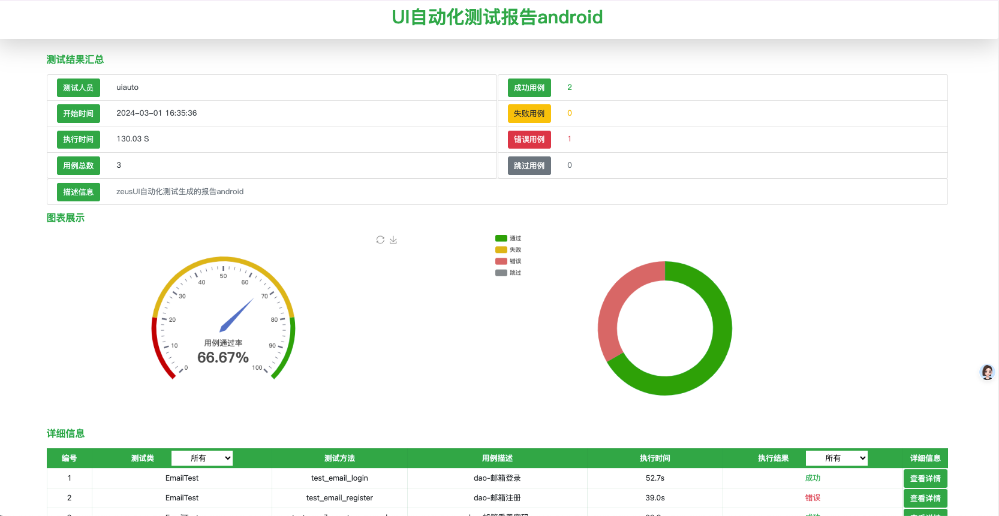

# DaoAutoui
dao ui auto
## 虚拟环境和依赖安装
virtualenv venv --python=3.9
source venv/bin/activate
pip install -r requirements.txt
## AirTest Api
1. 启动应用，参数为包名：start_app("com.topjoy.dao")
## jenkins创建虚拟环境后报错的解决方案，使用手动创建的虚拟环境
/Users/topjoy/.pyenv/shims/virtualenv -p python3 .venv
2. 测试用例执行,在 run 方法中配置执行什么平台
   ```shell
        python main.py 
   ```
3. 测试报告生成在 report 目录下
   


# Gradle版本兼容测试脚本

## 前置条件

1. Gradle和AGP版本字典，如果需要新增版本则追加在map中
   > key为Gradle版本，value为AGP版本
    ```python
   
        GRADLE_VERSION_DICT = {
            "6.7.1": "4.2.2",
            "8.7": "8.5.2",
            "7.3.3": "7.2.2"
        }
    ```

2. SDK_DEPENDENCY_VERSION配置要测试的SDK版本
3. PROJECT_DIR：测试项目的路径（样例使用为basic项目）
   APP_MODULE_PATH：app模块路径
   GRADLE_WRAPPER_PROPERTIES：项目级别的gradle-wrapper.properties配置路径
4. test_results：测试结果

## 注意事项

1. 如果gradle版本低于7.0，使用compileSdk为34会有异常，所以7.0版本之下使用33版本
2. gradle构建命令添加java版本，如果gradle大于8.0版本使用java17，否则使用java11

   ```python
       if gradle_version >= "8.0":
          gradle_command = f'JAVA_HOME="{java_17_path}" ./gradlew assembleDebug'
       else:
          gradle_command = f'JAVA_HOME="{java_11_path}" ./gradlew assembleDebug'

## 操作步骤

1. 直接执行main方法即可

